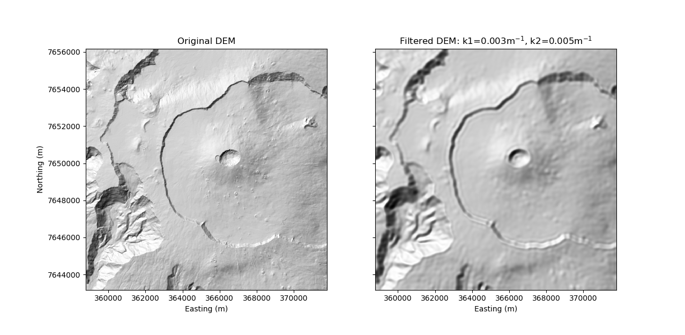
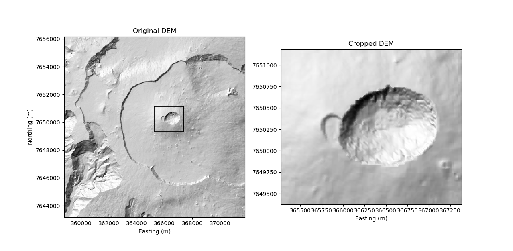
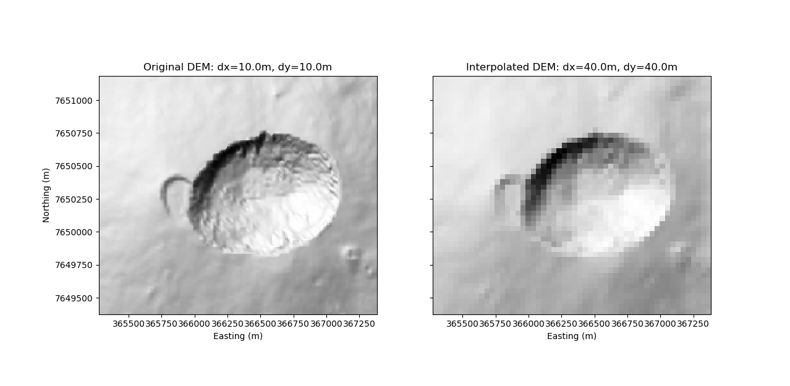
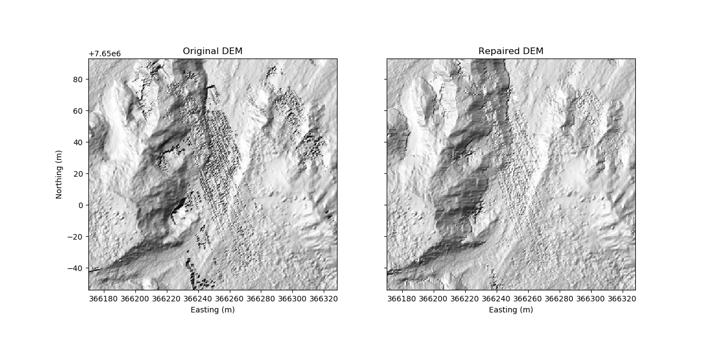

# DEM processing

This routine allows to process Digital Elevation Models (DEMs).
DEMs can be filtered, cropped, interpolated and repaired.

### Input parameters

The following parameters are defined in the file `input.txt`:

| Function      | Variable     | Type (unit) | Description  |
| ------------- |---------------|-------| ----------|
| Filtering     | *k1*, *k2*    | float (1/m) | Wavenumbers defining the low-pass filter (k1=0 if no filtering is required) |
| Cropping E    | *easting1*, *easting2*   | float (m) | New easting coordinates |
| Cropping N    | *northing1*, *northing2* | float (m) | New northing coordinates |
| Interpolating | *dx*, *dy*    |float (m) | New resolution step size |
| Repairing     | *repair_bool* |{True, False} | Specify if reparation is required |
| Input name    | *fileID*      |string | File name of DEM |
| Output name   | *outID*       |string | File name to save the processed DEM  |

## Example processing
The processing functions are presented in the following using a DEM-file of Piton de la Fournaise volcano, La Réunion. The shown figures are generated when processing a DEM file. 

### Filtering
This functions allows to low-pass filter the DEM in the wavenumber domain. For this, wavenumbers *k1* and *k2* are specified, defining the corner wavenumber and the maximum wavenumber of the filter, respectively. The filter is constructed with a cosinal transition between *k1* and *k2*. 

This means, that topographic variations of wavelengths < 1/*k1* are filtered. Wavelengths < 1/*k2* are completely removed.  

The figure below shows a topography before and after filtering. The acting filter was constructed by *k1=0.003*1/m and *k2=0.005*1/m, corresponding to wavelengths of 333.3m and 200.0m, respectively. 

### Cropping
This function crops a DEM according to the specified easting and northing coordinates. The cropped DEM is plotted after processing which allows to visually confirm that the correct region has been cropped.

### Interpolating
This function allows down- or up-sample a DEM file. A 2D spline interpolation is used for this. In the example shown below, the original DEM resolution was decimated by a factor of 4, going from 10m to 40m sampling distance.

### Repairing
Some DEM files may contain artefacts in form of spikes. The purpose of this function is to remove these artefacts by checking the gradient of the topography. Positions in the DEM with gradients above a certain threshold are repaired by leveling the elevation with the surroundings. This is carried out in a recursive manner while a maximum number of iteration is specified.

The figure below shows a DEM with spiky artefacts which has been repaired using a gradient threshold of 2 and 3 iterations. It can be observed that some healthy regions of the DEM are also affected by the reparation. For this reason, you may want to adjust the reparation parameters in the code depending on the given artefacts.

